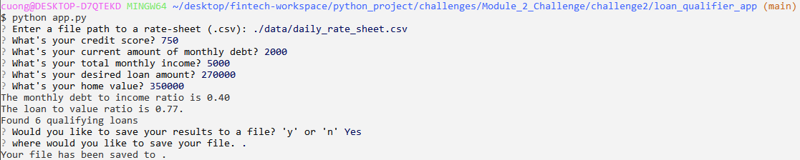

# Enhanced Loan Qualifier App

This app determines loan qualification based on user inputs of certain financial data by comparing the user's financial ratios against the daily_rate_sheet.csv which houses various lenders' loan qualification criteria (and change daily).

---

## Technologies

**Python 3.9** was used to code this app.  Libraries used are **Sys, Fire, Questionary, Pathlib and CSV**.

---

## Installation Guide

use the following code in Git Bash or Terminal to use this app:

```python
python app.py
```

---

## Usage

After running the app in Git Bash or Terminal, it will ask you to point to the daily rate sheet file.  the most recent daily sheet should be contained in:

>./data/daily_rate_sheet.csv

---

## Example


---

## Contributors

This was created by Cuong Ha

---

## License

public
